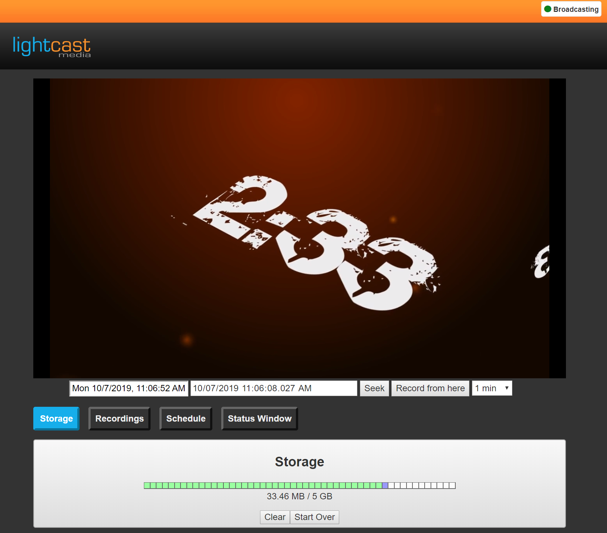
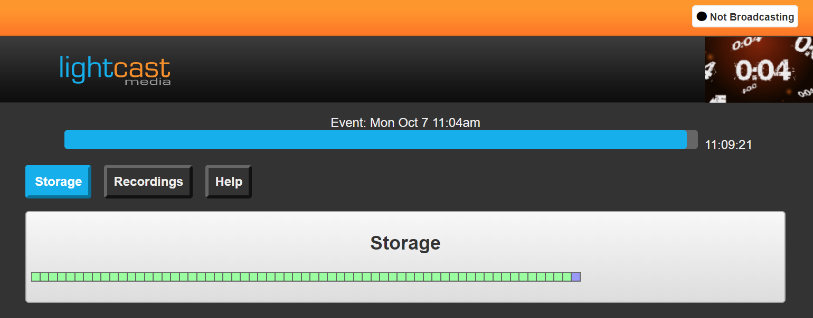
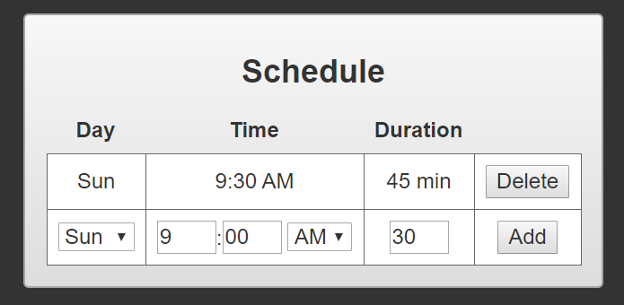

# multisite-dvp
Cloud/browser based video recorder / player for running multi-site events.

Client will likely only work with Chrome and derivatives.

Server must be nginx+nginx-rtmp with a specific configuration.

Needs major code cleanup.
Needs modification/porting for use with current version of hls.js.

## Features
Hybrid client-server DVR.  Live feed is stored on the server as well as the client.

Outage / connection protection.  Segments are downloaded and stored locally.  As long as there is extra time available, the player can survive full loss of connectivity at the client site and will warn the operator.  

Designed for multi-display systems.  Keep track of status and control on your operator display while running the main video to a projector or video distribution system.

Scheduled downloads/recordings.  Automatically download segments for a specific part of a service.

## Encoder Settings

Address: rtmp://hostname:1935/dvp
Stream instancename?key=########
Frame rate should be set to 30

Keyframe every 120 frames (every 4 seconds)
x264 profile High
Keyframe aligned checked
Strict Constant Bitrate checked

## Keyboard shortcuts:

| Purpose | Shortcut |
|--|--|
| Toggle full screen | Enter, F |
| Toggle play/pause | Space, Keypad 5 |
| Begin recording | R, * |
| Seek +10 minutes | +, Up Arrow |
| Seek -10 minutes | -, Down Arrow |
| Seek +1 minute | Right Arrow |
| Seek -1 minute | Left Arrow |
| Set focus to seek input | Keypad dot |
